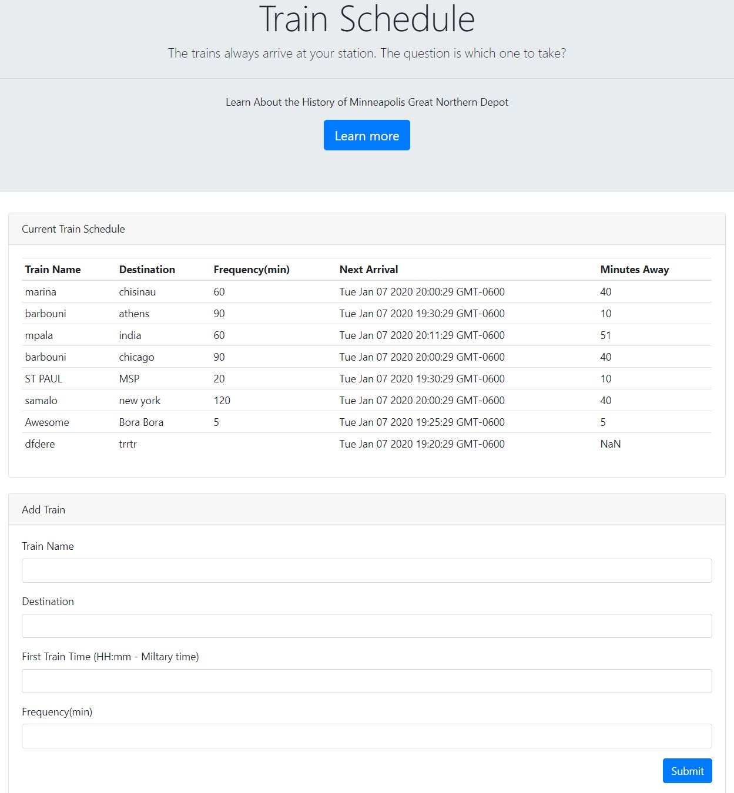

# Train-Scheduler Using Firebase & Moment.js 

A train schedule application that incorporates Firebase to host arrival and departure data. This website will provide up-to-date information about various trains, namely their arrival times and how many minutes remain until they arrive at their station.

## How it works

The app takes user inputed data and pushes it to a data-base. The program then retrieves it, compares the time that the orginal train left, takes in consideration the frequency of the train in minutes, and compares it to the current time. The app then posts when the next train will arrive. All of the data in the table is saved to the data-base and is appended to the page via JavaScript.

The app takes user inputed data and pushes it to a data-base. The program then retrieves it, compares the time that the orginal train left, takes in consideration the frequency of the train in minutes, and compares it to the current time. The app then posts when the next train will arrive. All of the data in the table is saved to the data-base and is appended to the page via JavaScript.
